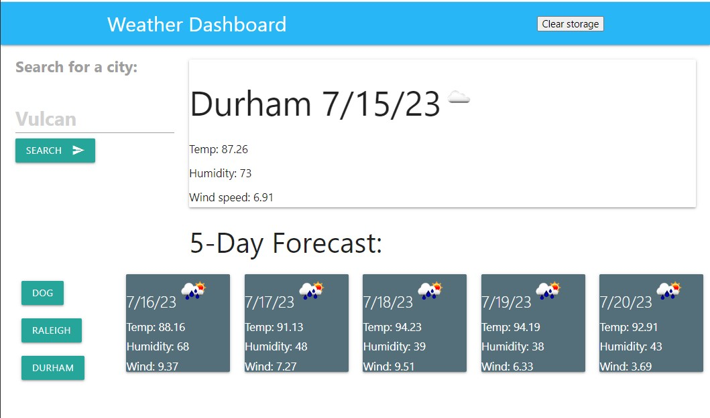

# 06-Better-Weather :grin:
## By Caine Winters

### Screenshot of Better Weather app

## Links
### [Link to repo](https://github.com/elcaine/06-Better-Weather)
### [Link to finished product](https://elcaine.github.io/06-Better-Weather/)

### Weather application mechanics
- Type city into search field
    - Enter or click <search> button to get results.
    - If text input field is empty no action.
    - If no city is found, "No City found" displayed (no weather data).
- Current city and date displayed prominently according to specification.
- 5-day forecast displayed before prominent current day according to specification.
- "Clear storage" button added to upper right area to refresh page with cleared storage. 

### Acknowledged sources
- [Materialize](
https://materializecss.com/getting-started.html) template used as starting point for code base
